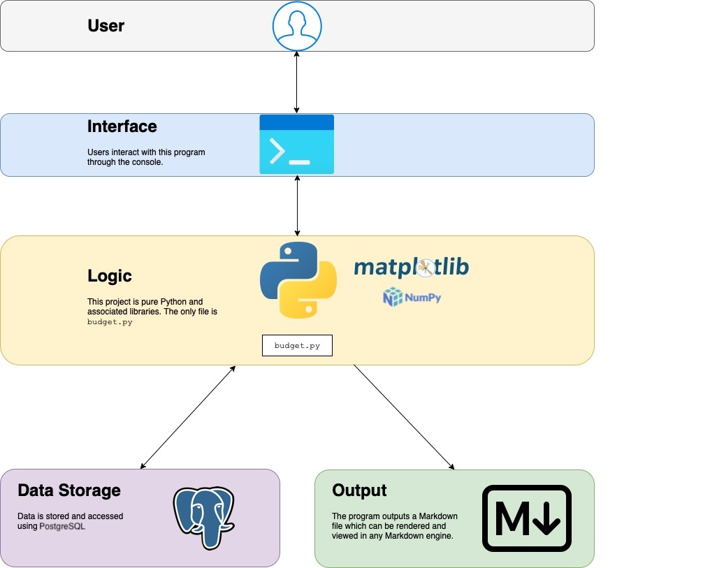

#  Finance Analyzer

This program is designed to track, analyze, and visualize financial habits using Python and libraries.


## Table of Contents
  1. [Background](#background)
  2. [Architecture](#architecture)
  3. [Input and Output](#input-and-output)
  4. [Description of Functionality](#description-of-functionality)
  5. [Usage](#usage)
  6. [External Libraries Used](#external-libraries-used)
  7. [Future Direction](#future-direction)
  

##  Background

This project started as a way for me to not have to manually update categorical amounts every time I added to my register, hence the use of openpyxl and Excel serving as the "database". 

While writing a script to add my expenses and let Python take care of the rest, I realized the opportunity for some data analysis and visualization. I decided to turn this analysis in a report. This automatically-generated report would be a nice way to show me my financial habits quickly and in a digestible manner.


## Architecture

The following image represents the current state of the project's architecture. There are some components that I am looking to change, namely implementing a database rather than just using Excel. See [Future Direction](#future) for more.



## Input and Output

The following shows the user's interaction with the program. The parts that are marked as `code` are part of the program. Regular text is user input. 

`bash-3.2$` python3 budget.py example_budget.xlsx -fl

```
Most recent entry: 7-10-22  Gas @ Shell ... category = ga  $67.76

Would you like to add an entry? y/n
```

y

```
Entry category:

     (r) rent

     (i) internet

     (e) electricity

     (g) groceries

     (eo) eating out

     (ga) gas

     (v) vehicle

     (d) dog

     (cn) consumer - need

     (cw) consumer - want

     (in) income
```
in

`Entry amount: $`*2000*

`Year:` 2022

`Month:` 7

`Day:` 15

`Description:` Paycheck

`Would you like to add an entry? y/n`

y

```
Entry category:

     (r) rent

     (i) internet

     (e) electricity

     (g) groceries

     (eo) eating out

     (ga) gas

     (v) vehicle

     (d) dog

     (cn) consumer - need

     (cw) consumer - want

     (in) income
   ```

d

`Entry amount: $`10

`Year:` 2022

`Month:` 7

`Day:` 19

`Description:` Treats for Fido

`Would you like to add an entry? y/n`

n

```
Time spent entering data: 0:00:49.118304

Time spent generating plots: 0:00:00.840138

Do you have debts to add? y/n
```

y

`Description:` Mortgage

`Amount: $`230000

`Do you have debts to add? y/n`

n

`Do you have assets to add? y/n`

y

`Description:` House

`Amount: $`450000

`Do you have assets to add? y/n`

n

`What is your credit score?` 789

`What is your source?` Experian

`What name would you like to appear on the report?` John J. Smith

```
Time spent entering additional data: 0:01:01.620029

Time spent generating report: 0:00:00.000552

Total time spent: 0:01:50.784277
```

This input, along with a couple of other pieces of existing data in the Excel sheet, produce the following report. Note that the report is generated as Markdown. This image shows the Markdown after it has been rendered.


##  Description of Functionality


###  Basics

The program will prompt user for expenses/incomes to add to the register, and add the data respectivly to the spreadsheet. The spreadsheet serves this system primarily as a database. A report, including plots, is generated at the end of running and can be found in the directory from which the program was run.

  

**Note: the report is written over each time the program is run. To save specific reports, you must do so manually.**

  

###  In addition to the basics,

  

###  `--display`

This argument opens the markdown file that is generated at the end of running. Note that this is by default done through QLMarkdown and **the codebase should be updated to your favorite application to view Markdown**.

  

###  `--credit`

A simple prompt that requires you to put in your credit score and the source from which you got it. Note that this is self-reporting - the program does not integrate with any credit services.

  

###  `--official`

Adds a line indicating whom this report was run for, which the user is prompted to input, to add a layer of officialness to the document in case it is being presented to to, for example, a bank.

  

###  `--networth`

Prompts user similarly to the core functionality to get all debts and assets, lists debts and assets in the report, and also calculates net worth, taking your current bank balance into consideration.


### `--register`

Shows a full register of your expenses.
  
###  `--full`

All of the above functionality is executed.

### `--no-reg`

Creates a full report without a register included.


## Usage


###  Getting Started

*Assuming all libraries are installed, which may require installation through `pip`, to start, do the following:*

1. Clone the repository

2. Open the example budget

1. You may adjust categories on the left, but note that if you get rid of/add categories, the code will need to be updated to reflect these changes.

3. Add the starting amount, likely either $0 or your bank balance, to the first row of the register, starting at `E2` on the Excel sheet. A valid row may look like this:

| Date | Description | Debit (+) | Credit (-) | Balance |

| ------ | ---------------- | --------- | ---------- | ------------- |

| 7/1/22 | Starting balance | | | $ 5,000.00 |

4. Update `budget.py` and `cetegories.py` to reflect your needs.
   a. `categories.py` needs to reflect the categories/cells you want to record for/to.
   b. `budget.py` needs to reflect the changes to `categories.py`
   c. Update the line `os.system("open report.md -a QLMarkdown")` in the second `if` in the `try-except` statement at the end of the file.

5. Run the program! To run the program, in your terminal, run `python3 budget.py <spreadsheet>.xlsx -args`, where `-args` is any (or none) of the following:

`--display, -d`

`--credit, -cr`

`--official, -of `

`--networth, -nw`

`--full, -fl`

  
##  External Libraries Used

The following libraries are the primary libraries I used to create this project. For a full list of depencies, please look at the imports at the top of `budget.py`

- Matplotlib

- NumPy

- openpyxl

- SnakeMD


## Future Direction

Going forward, I have a couple of main changes that I would like to take this project:

### Excel -> SQL

I did my financial tracking in Excel, including creating visualizations of my habits, and originally just started with this project to automate the updating of each categorical amount, which proved to be annoying to do manually. I would like to create a SQL database for the long-term use of this project.

### Investment and Saving Tracking

I would like to add additional functionality to this program to track investments and savings in a more focused fashion. This might be a standalone project that I addd to this project.