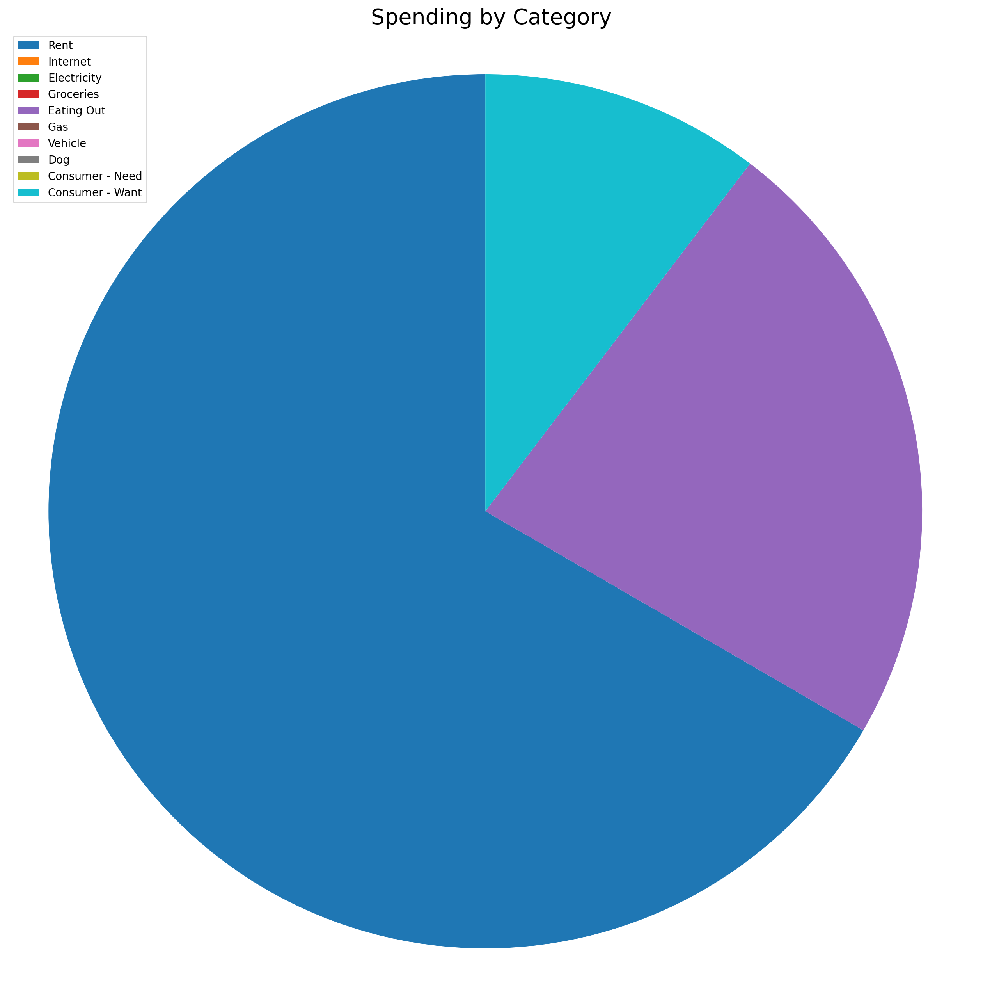
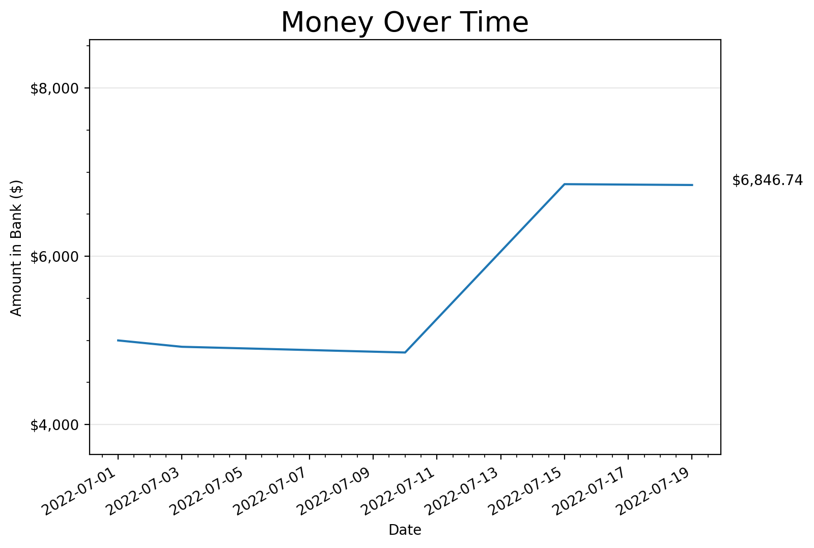
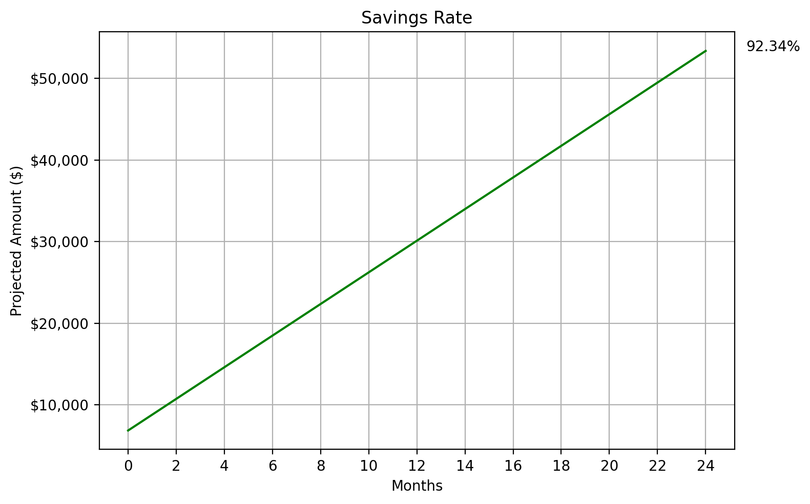

# Financial Report

###### Generated 8/1/2022 2:35 PM

###### This document reflects financial activity since 7/1/2022 (31 days).

---

## Spending Breakdown by Category

| Category        | Amount Spent | Percent of Spending |
| --------------- | ------------ | ------------------- |
| Rent            | $555.00      | 87.96%              |
| Internet        | $0.00        | 0.00%               |
| Electricity     | $0.00        | 0.00%               |
| Groceries       | $0.00        | 0.00%               |
| Eating Out      | $0.00        | 0.00%               |
| Gas             | $55.00       | 8.72%               |
| Vehicle         | $0.00        | 0.00%               |
| Dog             | $21.00       | 3.33%               |
| Consumer - Need | $0.00        | 0.00%               |
| Consumer - Want | $0.00        | 0.00%               |

| Category       | Amount Spent | Percent of Spending |
| -------------- | ------------ | ------------------- |
| Transportation | $55.00       | 8.72%               |
| Cost of Living | $576.00      | 91.28%              |
| **Total**      | **$631.00**  | **100.00%**         |

## Money Over Time

Amount of change since 07/01/2022 (31 days): **• $-131.00 • -13.10%**

## Income

| Category                 | Amount    |
| ------------------------ | --------- |
| Total Income             | $1,500.00 |
| Remaining After Spending | $869.00   |
| Saving                   | 57.93%    |

## Savings

Thus far, you have saved: **$869.00**

This is savings of **$28.03** per day. This graph shows how your savings are trending: 

**Notable projections:**

| Months | Projected Amount |
| ------ | ---------------- |
| 3      | $3,428.70        |
| 6      | $5,988.39        |
| 12     | $11,107.78       |
| 24     | $21,346.56       |

## Debts

| Description | Amount        |
| ----------- | ------------- |
| Temp        | $1,000.00     |
| **Total**   | **$1,000.00** |

## Assets

| Description | Amount        |
| ----------- | ------------- |
| another!    | $5,000.00     |
| Cash        | $869.00       |
| **Total**   | **$5,869.00** |

## Net Worth

| Category  | Amount         |
| --------- | -------------- |
| Debt      | $1,000.00      |
| Assets    | $5,869.00      |
| **Total** | **$+4,869.00** |

## Credit Score

Credit score as of 8/1/2022: **745**

*Source: NerdWallet*

# Appendix

## Register

| Date           | Amount        | Description          | Category | Balance       |
| -------------- | ------------- | -------------------- | -------- | ------------- |
| **2022-07-01** | **$1,000.00** | **Starting balance** | **in**   | **$1,000.00** |
| 2022-07-05     | $55.00        | gas                  | ga       | $945.00       |
| 2022-07-08     | $14.00        | dog food             | d        | $931.00       |
| 2022-07-09     | $7.00         | toys                 | d        | $924.00       |
| 2022-07-19     | $555.00       | rent                 | r        | $369.00       |
| **2022-07-25** | **$500.00**   | **Paycheck**         | **in**   | **$869.00**   |

  

> This report has been generated for Jacob on 8/1/2022.